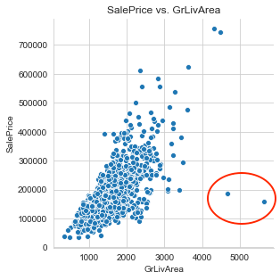
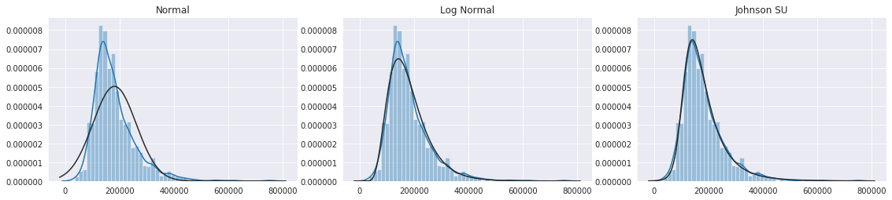

# Kaggle Project - Home Price Advanced Regression Techniques

## Executive Summary
This is a Kaggle competition that challenge the competitor's creative feature engineeing and advanced regression skills to predict the the home prices using 79 explanatory variables describing (almost) every aspect of residential homes in Ames, Iowa.


## Folder Structure

### 1. State the Problem
Predict the home prices using 79 explanatory variables describing (almost) every aspect of residential homes in Ames, Iowa.

### 2. Data Description
The data was downloaded from [Kaggle.com](https://www.kaggle.com/c/house-prices-advanced-regression-techniques/data). There are 1,460 properties with price labels in the train set and 1,459 without price label in the test set. Each home contains 79 features, and the description of these features can be found in this [file](./data/data_description.txt). 

**Acknowledgments**
The Ames Housing dataset was compiled by Dean De Cock for use in data science education. It's an incredible alternative for data scientists looking for a modernized and expanded version of the often cited Boston Housing dataset. 

### 3. Clean Data
Both the train and test sets contain missing values. The challenge is to distinguish the missing values (e.g., property missing basement data) from missing features (e.g., property has no basement) that are both presented as `NaN`. The feature descriptions are carefully reviewed. The missing value solution is carefully evaluated and executed feature-by-feature.  The cleaning summary for both train and test sets are summarized in the table below:

**Features with `NaN`**|**Pre-clean Train**|**Pre-clean Test**|**Description of `NaN`**|**Missing Value**|**Replacing Value**|**Post-clean Train**|**Post-clean Test**
:-----:|:-----:|:-----:|:-----:|:-----:|:-----:|:-----:|:-----:
MSZoning|0|4|Missing Data|Id: 1916, 2217, 2251, 2905|RL|0|0
LotFrontage|259|227|Property does not face street|--|--|259|227
Alley|1369|1352|No Alley|--|--|1369|1352
Utilities|0|2|Missing Data|Id: 1916, 1946|AllPub|0|0
Exterior1st|0|1|Missing Data|Id: 2152|Plywood|0|0
Exterior2nd|0|1|Missing Data|Id: 2152|Plywood|0|0
MasVnrType|8|16|None|Id: 2611|BrkFace|8|15
MasVnrArea|8|15|None|--|--|8|15
BsmtQual|37|44|No Basement|Id: 2218, 2219|2218: 'Fa', 2219: 'TA'|37|42
BsmtCond|37|45|No Basement|Id: 2041, 2186, 2525|TA|37|42
BsmtExposure|38|44|No Basement|Id: 949, 1488, 2349|No|37|42
BsmtFinType1|37|42|No Basement|--|--|37|42
BsmtFinSF1|0|1|Missing Data|Id: 2121|0|0|0
BsmtFinType2|38|42|No Basement|--|--|38|42
BsmtFinSF2|0|1|Missing Data|Id: 2121|0|0|0
BsmtUnfSF|0|1|Missing Data|Id: 2121|0|0|0
TotalBsmtSF|0|1|Missing Data|Id: 2121|0|0|0
BsmtFullBath|0|2|Missing Data|Id: 2121, 2189|0|0|0
BsmtHalfBath|0|2|Missing Data|Id: 2121, 2189|0|0|0
KitchenQual|0|1|Missing Data|Id: 1556|TA|0|0
Functional|0|2|Missing Data|Id: 2217, 2474|2217: Mod, 2474: Typ|0|0
FireplaceQu|690|730|No Fireplace|--|--|690|730
GarageType|81|76|No Garrage|--|--|81|76
GarageYrBlt|81|78|No Garrage|Id: 2127, 2577|YearBuilt|81|76
GarageFinish|81|78|No Garrage|Id: 2127, 2577|Unf|81|76
GarageCars|0|1|Missing Data|Id: 2577|1|0|0
GarageArea|0|1|Missing Data|Id: 2577|384|0|0
GarageQual|81|78|No Garrage|Id: 2127, 2577|TA|81|76
GarageCond|81|78|No Garrage|Id: 2127, 2577|TA|81|76
PoolQC|1453|1456|No Pool|--|--|1453|1456
Fence|1179|1169|No Fence|--|--|1179|1169
MiscFeature|1406|1408|No MF|--|--|1406|1408
SaleType|0|1|Missing Data|id: 2490|WD|0|0

### 4. Explore Data (EDA)
Data are explored in this section mainly using **data visualization** technique for the following two main purposes:
- Evaluate and decide feature engineering strategy, and
- Explore and decide the initial regression algorithms

For feature engineering, the EDA process evaluated 4 proposals: **Remove Outliers**, **Transform Numerical Features**, **Encode Categorical Features**, and **Generate Polynomial Terms**.

#### 4.1 Remove Outliers
Scatter plot is used to explore the outliers. Three ourliers including 1 invalid outlier due to typo for `YearBuilt` and 2 valid outliers. The typo is fixed during the data cleaning process. Two valid outliers are presented in the scatter plot below.
. 

Two vary large home, properties `1299` and `524` (circled in red), were sold at unusually low prices. The solution is to remove these two outliers to improve the model generalization, which is validated by the Kaggle competition score discussed in the **Section 6**. 


#### 4.2 Transform Numerical Features
Transforming the right-skewed data to normal distribution is a frequently used technique for improving the model. The distribution of numerical features and price label are explored using histogram through **Seaborn** package's `histplot` method. For features shows right-skewed distribution, `normal`, `log`, and `Johnson SU` transformation are evaluated using overlapping fitting lines to expore the best transformation option. See the EDA for `SalePrice` below as an example.


Sklearn's `PowerTransformer` and its default option of `yeo-johnson` is used to transform the following features.
```
              ['LotFrontage', 
              'LotArea', 
              'BsmtUnfSF', 
              'TotalBsmtSF', 
              '1stFlrSF', 
              'GrLivArea',
              'GarageArea']
```

#### 4.3 Encode Categorical Features


#### 4.4 Generate Polynomial Features


### Model Data

### Evaluate Model

### Next Step